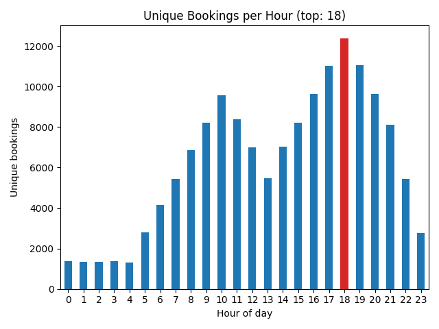
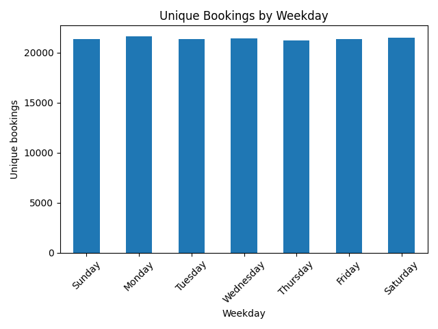
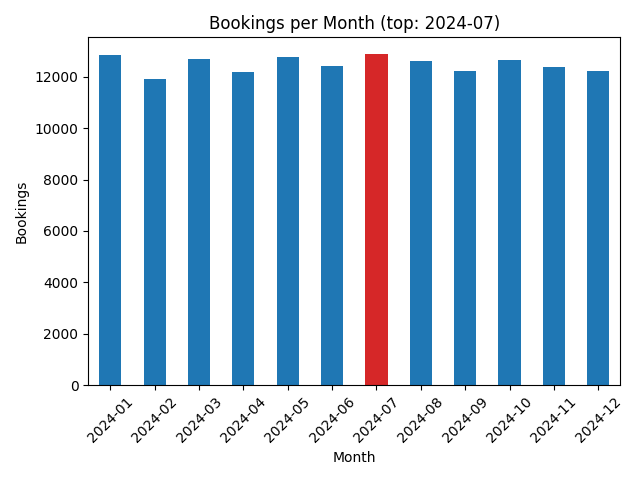
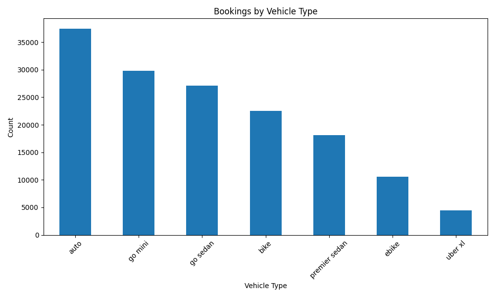
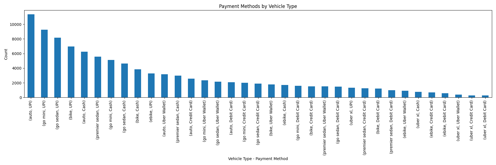
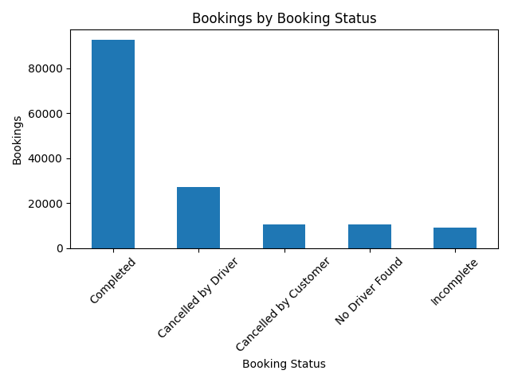
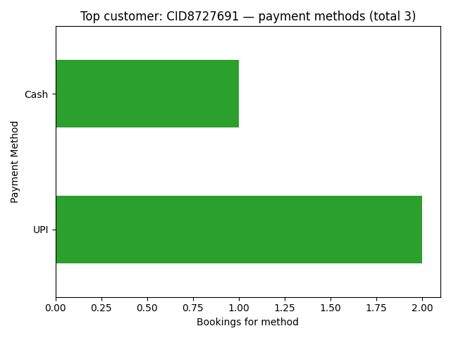

# Uber Ride Analytics

A comprehensive data analytics project exploring Uber ride patterns with FastAPI APIs, ETL pipelines, and interactive visualizations. Features both CSV (DuckDB/Pandas) and Postgres backends for flexible data analysis.

## Analytics & Insights

This project provides deep insights into Uber ride patterns through comprehensive data analysis and visualizations:

### Key Metrics Analyzed
- **150,000+ ride bookings** across different vehicle types
- **Time-based patterns**: hourly, daily, and monthly booking trends
- **Customer behavior**: payment preferences and booking frequency
- **Service performance**: completion rates and cancellation patterns
- **Vehicle type preferences**: demand distribution across ride options

### Visualizations

#### Booking Patterns Over Time


**Strategic Insight**: The clear winner is the 18th hour (6 PM), indicating peak demand when people leave work. This presents an opportunity to offer strategic discounts to high-traffic areas during this time window, potentially driving more app usage and customer engagement.



**Strategic Insight**: Surprisingly, Monday shows the highest booking volume, likely related to the evening rush hour pattern. Since weekends also show strong demand for entertainment purposes, offering targeted discounts to strategic entertainment locations could capture more weekend leisure traffic.



**Strategic Insight**: Monthly trends reveal seasonal patterns that can inform dynamic pricing strategies and resource allocation across different time periods.

#### Vehicle Type Analysis


**Strategic Insight**: Customers predominantly let the app select vehicle types rather than choosing specific options. This is advantageous as it allows the algorithm to optimize for operational efficiency and customer satisfaction while maintaining flexibility in vehicle allocation.



**Strategic Insight**: Payment preferences vary significantly by vehicle type, indicating different customer segments with distinct payment behaviors that can inform targeted marketing strategies.

#### Service Performance


**Critical Operational Insight**: Driver cancellations nearly triple customer cancellations, revealing a significant operational challenge. This suggests potential driver satisfaction issues that could lead to customer dissatisfaction and operational instability. Implementing cancellation reason tracking would provide crucial diagnostic data for addressing root causes.


**Market Intelligence**: UPI dominates as the preferred payment method, followed by cash, clearly indicating the Indian market context. This reveals that "Auto" refers to auto-rickshaws, a common Indian public transport method, providing crucial regional context for business strategy.



**Customer Segmentation**: Payment preferences of frequent customers show distinct patterns that can inform loyalty programs and personalized service offerings.

### Data Schema
The analysis is built on a comprehensive dataset with the following structure:
- **Date/Time**: Temporal analysis capabilities
- **Booking ID**: Unique identifier for each ride
- **Customer ID**: Customer behavior tracking
- **Vehicle Type**: Service category analysis
- **Payment Method**: Transaction preference insights
- **Booking Status**: Service performance metrics

## Setup

1) Create/activate venv
```bash
python3 -m venv .venv
source .venv/bin/activate
```

2) Install deps
```bash
pip install -r requirements.txt
```

3) Environment
- Copy `ENV.sample` to `.env` and adjust values
```bash
cp ENV.sample .env
```
- CSV-backed API uses `CSV_PATH` (default `./data/cleaned_up_pandas.csv`)
- Postgres API uses `PG_HOST`, `PG_PORT`, `PG_DB`, `PG_USER`, `PG_PASSWORD`

### One-liners (Makefile)
```bash
make env install        # set up .env and install deps
make run-csv            # start CSV-backed API at :8000
make run-pg             # start Postgres API at :8001
make etl                # load CSV into Postgres (uses CSV_PATH)
make test               # run tests
```

## Run

CSV-backed API:
```bash
uvicorn src.api.main:app --reload --port 8000
```

Postgres-backed API:
```bash
uvicorn src.api.main_db:app --reload --port 8001
```

## ETL: Load CSV into Postgres

Configure `.env` (or `ENV.sample`) with Postgres credentials and `CSV_PATH` to the CSV file (defaults to `./data/cleaned_up_pandas.csv`), then run:

```bash
make etl
# or
python -m src.etl.load_csv_to_postgres
```

This will:
- Create the `uber_bookings` table (id, date, time, booking_id unique, booking_status, customer_id, vehicle_type, payment_method)
- Normalize the CSV schema
- Upsert with `ON CONFLICT DO NOTHING` on `booking_id`
- Create helpful indexes

## Tests
```bash
python -m pytest -q
```

## Notes
- `pytest.ini` sets `pythonpath=.` so imports like `from src.api import main` work.
- Large data files in `data/` are git-ignored; place your CSVs there.
